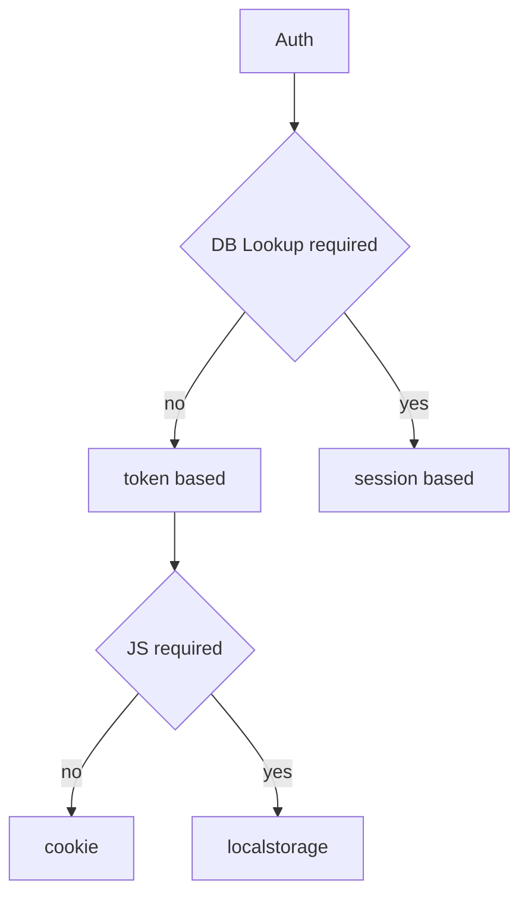

```mermaid
flowchart
    A[Auth]
	B{DB Lookup required}
	C[token based]
	D[session based]
	E{JS required}
	I[localstorage]
	H[cookie]

	A --> B
	B -->|no|C
	B --> |yes| D

	C --> E


	E --> |no| H
	E --> |yes| I
```
