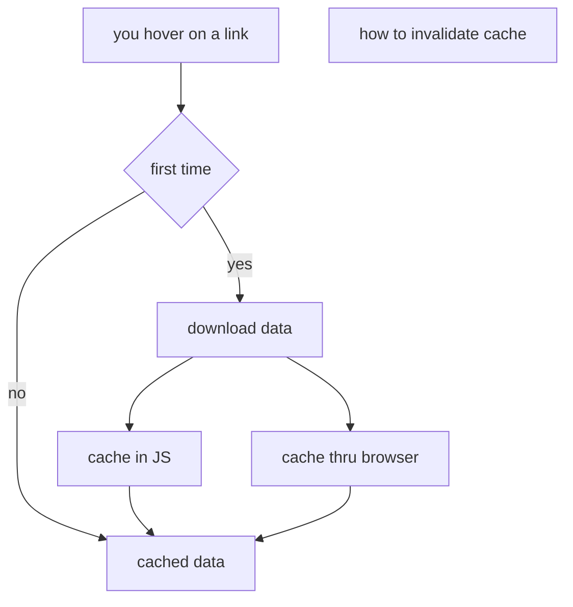

```mermaid
flowchart
B[you hover on a link]
C[download data]
D[cached data]
E{first time}
F[cache in JS]
G[cache thru browser]
h[how to invalidate cache]

B--> E
E --> |yes| C
E-->|no| D
C--> F
C--> G
F-->D
G-->D
```
